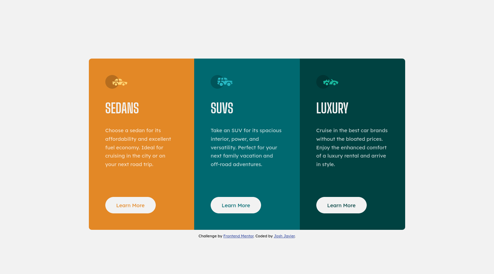

# Frontend Mentor - 3-column preview card component solution

This is a solution to the [3-column preview card component challenge on Frontend Mentor](https://www.frontendmentor.io/challenges/3column-preview-card-component-pH92eAR2-). Frontend Mentor challenges help you improve your coding skills by building realistic projects. 

## Table of contents

- [Overview](#overview)
  - [The challenge](#the-challenge)
  - [Screenshot](#screenshot)
  - [Links](#links)
- [My process](#my-process)
  - [Built with](#built-with)
  - [What I learned](#what-i-learned)
  - [Continued development](#continued-development)
  - [Useful resources](#useful-resources)
- [Author](#author)
- [Acknowledgments](#acknowledgments)

## Overview

### The challenge

Users should be able to:

- View the optimal layout depending on their device's screen size
- See hover states for interactive elements

### Screenshot

### Links

- Solution URL: [https://www.frontendmentor.io/solutions/3column-preview-card-using-flexbox-and-sass-O1f_MSbpi](https://www.frontendmentor.io/solutions/3column-preview-card-using-flexbox-and-sass-O1f_MSbpi)
- Live Site URL: [https://joshjavier.github.io/3-column-preview-card-component/](https://joshjavier.github.io/3-column-preview-card-component/)

## My process

### Built with

- Semantic HTML5 markup
- CSS custom properties
- Flexbox
- Mobile-first workflow
- [Sass](https://sass-lang.com/)

### What I learned

- Used Sass in a project for the first time! Although this is only a tiny project, I was able to get familiar with the concept of modularity and breaking up CSS.

- Using a screenreader-only element. In this case, the design had three headings of the same level. Instead of using three `h1` elements, it's more semantic to use a screenreader-only `h1` element that describes that the page is about, and then set the visible headings to `h2`.

### Continued development

- Looking forward to using Sass on bigger projects with more complex structures.
- Practice writing better CSS (which leads to more organized Sass code).

### Useful resources

- [Structuring your Sass Projects](https://itnext.io/structuring-your-sass-projects-c8d41fa55ed4) - This article talks about best practices on Sass project structure for simple and more complex projects.
- [Combining SASS variables with CSS custom properties](https://dev.to/nicm42/combining-sass-variables-with-css-custom-properties-5hj7) - This article helped me understand the difference between Sass and CSS variables when I encountered an issue trying to use both in my declarations.
- [How should SASS files be handled in a .gitignore file and why?](https://www.quora.com/How-should-SASS-files-be-handled-in-a-gitignore-file-and-why?top_ans=10324085) - Sass files that should not be committed to version control.
- [Do I need to include SASS files on my github repo?](https://www.reddit.com/r/webdev/comments/aefh4w/do_i_need_to_include_sass_files_on_my_github_repo/edou95r/?context=3) - Although this reddit answer recommends including the Sass and *not* the CSS, I also commited my CSS into version control so Github Pages can render the preview site (one less step vs. setting up Netlify).
- [Sass Guidelines](https://sass-guidelin.es/) - An opinionated styleguide for writing sane, maintainable and scalable Sass. Skimmed, added to post-project readings.

## Author

- Website - [Josh Javier](https://joshjavier.com/)
- Frontend Mentor - [@joshjavier](https://www.frontendmentor.io/profile/joshjavier)
- Twitter - [@joshjavierr](https://twitter.com/joshjavierr)
- Codepen - [@joshjavier](https://codepen.io/joshjavier/)

## Acknowledgments

Thanks to [Raymart Pamplona](https://www.frontendmentor.io/profile/pikamart) for the helpful feedback on semantics and media queries, as well as practical insights on scss structure.